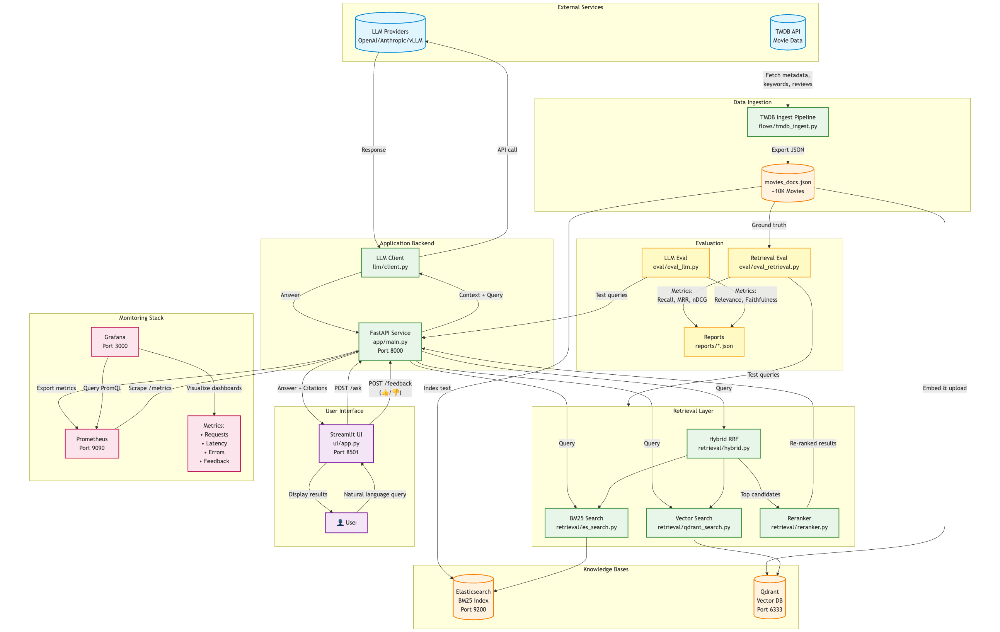
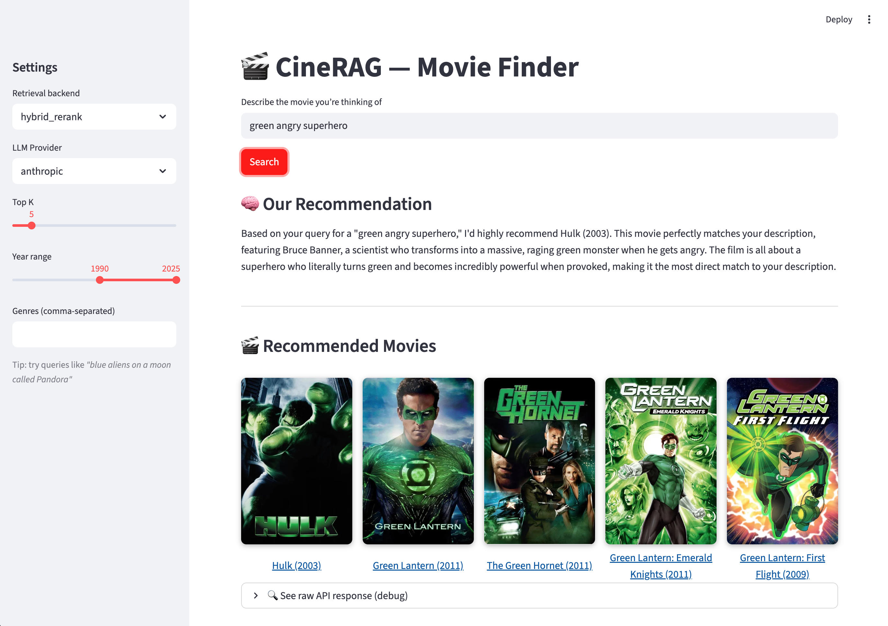
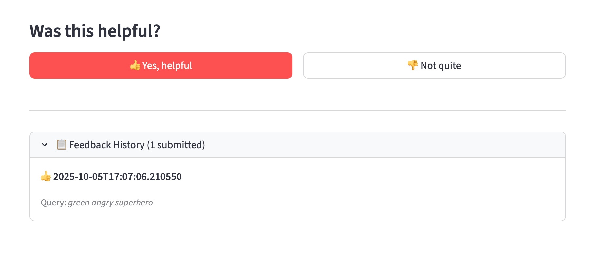
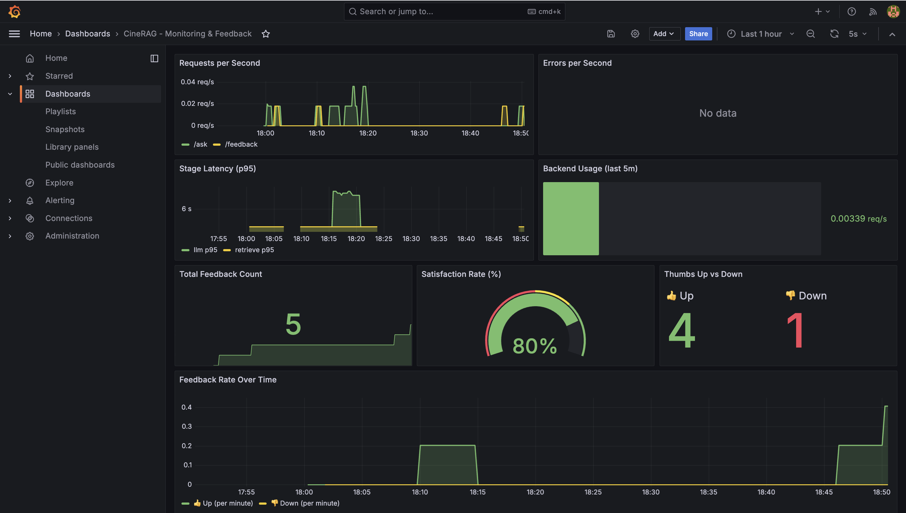
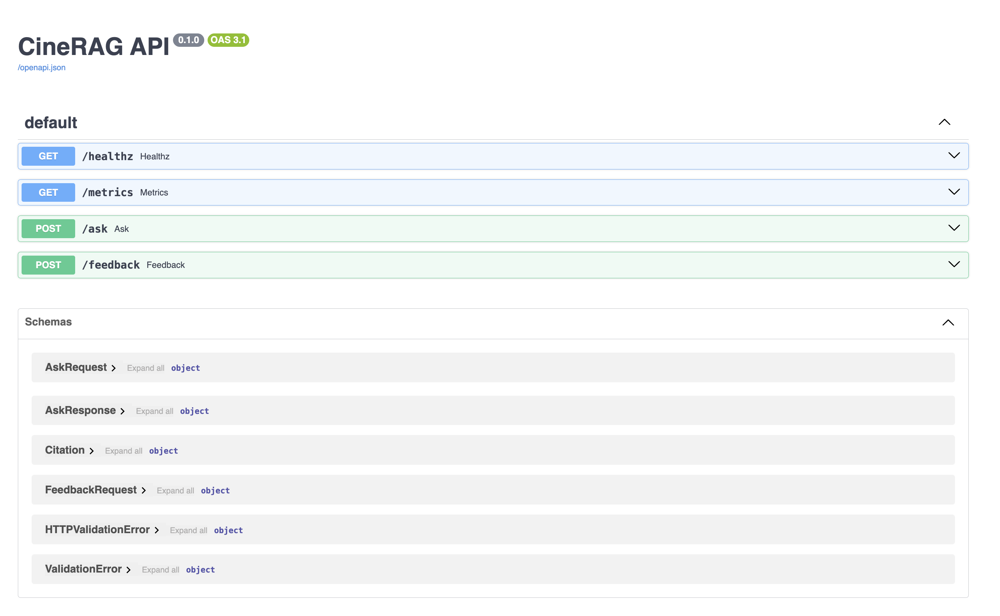

# CineRAG - Movie Recommendation RAG System 🎬

A Retrieval-Augmented Generation (RAG) application that helps users discover movies through natural language queries using TMDB data, multiple retrieval strategies, and intelligent ranking.

---

## 📋 Problem Description

**The Challenge**: Traditional movie search relies on exact keyword matching or requires users to know specific titles, actors, or genres. Users often remember movies by plot elements, themes, or vague descriptions like "that movie with blue aliens on another planet."

**The Solution**: CineRAG bridges this gap by combining:
- **Semantic understanding** of movie descriptions through embeddings
- **Traditional keyword search** for precise matching
- **Hybrid retrieval** that balances both approaches
- **RAG architecture** to provide contextually relevant recommendations

**Why RAG for Movies?**
- Movies have rich metadata (plot, reviews, keywords, cast) perfect for RAG
- Natural language queries are more intuitive than filters
- Combining multiple retrieval methods improves accuracy
- User feedback loop enables continuous improvement

**Target Users**:
- Movie enthusiasts searching by plot elements
- Recommendation seekers looking for similar films
- Users with vague movie memories
- Data scientists exploring RAG implementations

---

## 🎯 Project Overview

CineRAG is a full-stack RAG application featuring:
- **Multiple retrieval backends** (BM25, Vector, Hybrid, Reranking)
- **Comprehensive evaluation** framework with multiple metrics
- **Interactive Streamlit UI** with user feedback collection
- **Production-ready monitoring** via Prometheus & Grafana
- **Automated data ingestion** from TMDB API
- **Fully containerized** deployment

### Architecture



**Key Components**:
1. **Data Ingestion** - TMDB API pipeline enriches movies with metadata
2. **Knowledge Bases** - Elasticsearch (BM25) + Qdrant (vectors)
3. **Retrieval Layer** - Multiple strategies with evaluation
4. **FastAPI Backend** - RESTful API with Prometheus metrics
5. **Streamlit UI** - User-friendly interface with feedback
6. **Monitoring Stack** - Real-time observability

---

## 🏗️ Architecture & Components

### 1. Data Ingestion Pipeline

**Implementation**: `flows/tmdb_ingest.py`

The ingestion pipeline fetches and enriches movie data from TMDB.

> **Note**: TMDB has over 1 million movies in their database. For this demonstration project, we use approximately 10,000 movies (500 pages of results). This sample size is sufficient to showcase RAG capabilities while keeping resource requirements manageable for development and testing.

**Process**:
1. Discover popular movies via TMDB `/discover/movie` endpoint
2. For each movie, fetch:
   - Basic metadata (title, year, genres, runtime)
   - Plot overview and tagline
   - Keywords and reviews
   - Director and top 5 cast members
3. Construct rich `index_text` field combining all metadata
4. Export to JSON for indexing

**Running Ingestion**:

```bash
# Full dataset (500 pages = 10000 movies)
make ingest
```

**Output Format**:
```json
{
  "id": "tmdb:movie:19995",
  "title": "Avatar",
  "year": 2009,
  "genres": ["Action", "Adventure", "Fantasy", "Science Fiction"],
  "keywords": ["future", "marine", "alien planet", ...],
  "people": {
    "director": ["James Cameron"],
    "cast": ["Sam Worthington", "Zoe Saldana", ...]
  },
  "index_text": "Avatar — Enter the World of Pandora. In the 22nd century..."
}
```

---

### 2. Knowledge Base Setup

**Elasticsearch (BM25 Search)**:
- Index: `movies_bm25`
- Field mapping: `index_text` with standard analyzer
- Setup: `retrieval/es_setup.py`
- Indexing: `retrieval/es_index.py`

**Qdrant (Vector Search)**:
- Collection: `movies_vec`
- Embedding model: `all-MiniLM-L6-v2` (384 dimensions)
- Distance: Cosine similarity
- Payload: Full movie metadata
- Setup & upload: `retrieval/qdrant_upsert.py`

**Indexing Commands**:
```bash
# Start infrastructure
docker compose up -d elasticsearch qdrant

# Index into both systems
make es-index
make qdrant-upsert
```

---

### 3. Retrieval Evaluation

**Evaluation Script**: `eval/eval_retrieval.py`

#### Retrieval Approaches Tested

| Backend | Description | Implementation |
|---------|-------------|----------------|
| **BM25** | Classic keyword-based search via Elasticsearch | `retrieval/es_search.py` |
| **Vector** | Semantic search using embeddings via Qdrant | `retrieval/qdrant_search.py` |
| **Hybrid** | RRF fusion of BM25 + Vector results | `retrieval/hybrid.py` |
| **Hybrid + Rerank** | Hybrid results re-ranked by cross-encoder | `retrieval/reranker.py` |

#### Evaluation Metrics

**Metrics Implementation**: `eval/eval_metrics.py`

- **Recall@5 / Recall@10**: Percentage of relevant docs in top K results
- **MRR (Mean Reciprocal Rank)**: Average of reciprocal ranks of first relevant result
- **nDCG@10**: Normalized Discounted Cumulative Gain considering ranking quality

#### Evaluation Dataset

**File**: `eval/eval_queries.jsonl`

Format:
```json
{"query": "blue aliens on Pandora with human avatars", "gold": ["tmdb:movie:19995"]}
{"query": "heist movie with dream within a dream", "gold": ["tmdb:movie:27205"]}
```

#### Running Evaluation

```bash
# Run evaluation on all backends
make eval

# Custom evaluation
uv run python -m eval.eval_retrieval \
  --eval eval/eval_queries.jsonl \
  --backends es qdrant hybrid hybrid_rerank \
  --k 10 \
  --docs movies_docs.json
```

#### Results

| Backend | Recall@5 | Recall@10 | MRR | nDCG@10 |
|---------|----------|-----------|-----|---------|
| BM25 | 0.20 | 0.40 | 0.237 | 0.26 |
| Vector | 0.40 | 0.80 | 0.306 | 0.418 |
| Hybrid | 0.60 | 0.80 | 0.495 | 0.567 |
| **Hybrid + Rerank** | **0.80** | **0.80** | **0.70** | **0.726** |

**Analysis**:
- **BM25** excels at exact keyword matches (titles, actor names)
- **Vector search** captures semantic similarity and thematic elements
- **Hybrid RRF** balances both approaches, improving overall recall
- **Reranking** provides final quality boost by re-scoring top candidates with a more powerful cross-encoder model

---

### 4. RAG Flow

**Implementation**: `app/main.py`

#### Query Processing Pipeline

1. **User submits query** via UI or API
2. **Backend selection** (auto-selected based on available models, or user-specified)
3. **Retrieval**:
   - Apply year/genre filters if specified
   - Retrieve top-K candidates from selected backend
   - For hybrid_rerank: retrieve 50 candidates, rerank to top-K
4. **Context construction**: Gather full metadata for retrieved movies
5. **Response generation**: Format results with citations
6. **Metrics collection**: Track latency, backend usage, errors

#### API Endpoints

**POST `/ask`**:
```bash
curl -X POST http://localhost:8000/ask \
  -H "Content-Type: application/json" \
  -d '{
    "query": "space movie with AI",
    "top_k": 5,
    "backend": "hybrid_rerank",
    "year": [2000, 2024],
    "genres": ["Science Fiction"]
  }'
```

**Response**:
```json
{
  "answer": "Top matches for 'space movie with AI': ...",
  "citations": [
    {"tmdb_id": "tmdb:movie:157336", "title": "Interstellar", "year": 2014}
  ],
  "retrieved": [
    {"score": 0.952, "tmdb_id": "tmdb:movie:157336"}
  ],
  "backend": "hybrid_rerank"
}
```

**POST `/feedback`**: Collect user thumbs up/down feedback

**GET `/healthz`**: Health check endpoint

**GET `/metrics`**: Prometheus metrics endpoint

---

### 5. LLM Evaluation

**Implementation**: `eval/eval_llm.py`, `eval/eval_llm_metrics.py`

The system generates natural language answers using LLMs and evaluates them across multiple dimensions.

#### Answer Generation

The RAG flow (`app/main.py`) uses retrieved movie documents as context to generate answers:

1. **Retrieve** top-K relevant movies
2. **Build context** from movie metadata (title, year, genres, overview)
3. **Generate answer** using LLM with prompt engineering
4. **Return** natural language response with citations

#### Evaluation Dataset

**File**: `eval/eval_llm_queries.jsonl`

Format:
```json
{
  "qid": 1,
  "query": "blue aliens on Pandora with human avatars",
  "gold": ["tmdb:movie:19995"],
  "expected_aspects": ["blue aliens", "Pandora", "avatars", "humans"]
}
```

#### Evaluation Metrics (LLM-as-a-Judge)

**Metrics Implementation**: `eval/eval_llm_metrics.py`

- **Relevance** (0-1): Does the answer address the user's query?
- **Faithfulness** (0-1): Is the answer grounded in the provided context without hallucinations?
- **Coherence** (0-1): Is the answer well-structured and easy to understand?
- **Aspect Coverage** (0-1): Does the answer cover expected aspects from the query?
- **Overall** (0-1): Average of all metrics

Uses LLM-as-a-judge approach with structured prompts to evaluate each dimension.

#### Running LLM Evaluation

```bash
# Run LLM evaluation
make eval-llm

# Or with custom parameters
uv run python -m eval.eval_llm \
  --eval eval/eval_llm_queries.jsonl \
  --docs movies_docs.json \
  --backend hybrid_rerank \
  --top-k 5 \
  --out reports/llm_eval_results.json

# Run both retrieval and LLM evaluation
make eval-all
```

#### Results

| Metric | Mean | Median | StdDev | Min | Max |
|--------|------|--------|--------|-----|-----|
| **Relevance** | 0.925 | 1.0 | 0.121 | 0.75 | 1.0 |
| **Faithfulness** | 0.85 | 1.0 | 0.211 | 0.5 | 1.0 |
| **Coherence** | 0.775 | 0.75 | 0.079 | 0.75 | 1.0 |
| **Aspect Coverage** | 0.875 | 1.0 | 0.212 | 0.5 | 1.0 |
| **Overall** | 0.856 | 0.938 | 0.135 | 0.625 | 1.0 |

**Analysis**:
- Higher relevance scores indicate better query understanding
- High faithfulness means minimal hallucinations
- Coherence measures response quality
- Aspect coverage shows comprehensive answers

#### LLM Configuration

Supports multiple providers. Configure via environment variables:

```bash
# OpenAI (default)
export LLM_PROVIDER=openai
export OPENAI_API_KEY=sk-...
export OPENAI_MODEL=gpt-4o-mini

# Anthropic
export LLM_PROVIDER=anthropic
export ANTHROPIC_API_KEY=sk-ant-...
export ANTHROPIC_MODEL=claude-3-5-sonnet-20241022

# vLLM (local server)
export LLM_PROVIDER=vllm
export VLLM_BASE_URL=http://localhost:8001/v1
export VLLM_MODEL=qwen2.5-7b-instruct
```

---

### 6. Interface

**Implementation**: `ui/app.py`

The Streamlit interface provides an intuitive way to interact with CineRAG.

#### Features

**Search Interface**:
- Natural language query input
- Backend selection (auto, hybrid_rerank, hybrid, qdrant, es)
- Top-K results slider
- Year range filter (1950-2025)
- Genre filtering (comma-separated)

**Results Display**:
- Formatted answer with clickable movie posters links
- Debug expander showing retrieval scores



**User Feedback**:
- Thumbs up/down buttons
- Feedback sent to API for monitoring
- Tracked in Prometheus metrics



#### Running the UI

```bash
# Via Docker Compose (recommended)
docker compose up -d ui

# Or locally
streamlit run ui/app.py
```

**Access**: http://localhost:8501

---

### 7. Monitoring

**Implementation**: `monitoring/prometheus.yml`, `monitoring/grafana/`

#### Prometheus Metrics Tracked

**In `app/main.py`**:

- `cinerag_requests_total` - Total requests by endpoint
- `cinerag_errors_total` - Errors by endpoint and type
- `cinerag_stage_latency_seconds` - Latency histogram per stage
- `cinerag_backend_requests_total` - Backend usage distribution
- `cinerag_feedback_total` - User feedback (thumbs up/down)

#### Grafana Dashboards

Pre-configured dashboards visualize:
- Request rate and error rate over time
- Latency percentiles (p50, p95, p99)
- Backend usage distribution
- User feedback sentiment trends




#### Accessing Monitoring

```bash
# Start monitoring stack
make monitoring

# Or via Docker Compose
docker compose up -d prometheus grafana
```

**URLs**:
- Prometheus: http://localhost:9090
- Grafana: http://localhost:3000 (admin/admin)

---

### 8. Containerization

**Implementation**: `docker-compose.yml`

All services are containerized for easy deployment:

#### Services

| Service | Image | Port | Purpose |
|---------|-------|------|---------|
| **elasticsearch** | elasticsearch:8.14.1 | 9200 | BM25 search engine |
| **qdrant** | qdrant:v1.9.0 | 6333, 6334 | Vector database |
| **api** | Custom (Dockerfile.api) | 8000 | FastAPI backend |
| **ui** | Custom (Dockerfile.ui) | 8501 | Streamlit interface |
| **prometheus** | prometheus:v2.55.1 | 9090 | Metrics collection |
| **grafana** | grafana:10.4.8 | 3000 | Visualization |

#### Docker Compose Commands

```bash
# Start all services
docker compose up -d

# Start specific services
docker compose up -d elasticsearch qdrant
docker compose up -d api ui
docker compose up -d prometheus grafana

# View logs
docker compose logs -f api

# Stop all
docker compose down

# Stop and remove volumes
docker compose down -v
```

#### Resource Requirements

**Minimum**:
- 4 GB RAM
- 10 GB disk space
- Docker Engine 20.10+

**Recommended**:
- 8 GB RAM
- 20 GB disk space (for larger datasets)

---

## 🚀 Getting Started

### Prerequisites

- **Python 3.12**
- **Docker & Docker Compose**
- **TMDB API v4 Bearer Token** - [Get one here](https://developer.themoviedb.org/docs/getting-started)
- **uv** (recommended, for reproducible builds): `curl -LsSf https://astral.sh/uv/install.sh | sh` or see [installation docs](https://docs.astral.sh/uv/getting-started/installation/)

### Installation & Setup

#### Step 1: Clone and Setup Environment

```bash
# Navigate to project
cd cinerag_project

# Sync dependencies from pyproject.toml (creates venv + installs exact versions)
uv sync

# Activate the virtual environment
source .venv/bin/activate
```

> **Note**: `uv sync` reads from `pyproject.toml` and `uv.lock` to ensure you get the exact package versions used in development, guaranteeing reproducibility. Dependencies are managed in `pyproject.toml` (modern Python standard).

#### Step 2: Configure Environment Variables

```bash
# Copy example env file
cp .env.example .env

# Edit .env and add your TMDB token:
echo "TMDB_API_TOKEN=YOUR_V4_BEARER_TOKEN" >> .env

# Optional: Add LLM API keys if implementing full RAG
# echo "OPENAI_API_KEY=sk-..." >> .env
# echo "OPENAI_MODEL=gpt-4o-mini" >> .env
```

#### Step 3: Ingest Movie Data

```bash
# Full dataset (500 pages = ~10000 movies)
make ingest
```

This will create `movies_docs.json` in your project root.

#### Step 4: Start Infrastructure

```bash
docker compose up -d
```

This starts Elasticsearch, Qdrant, and all other services.

Wait ~30 seconds for Elasticsearch to be ready.

#### Step 5: Index Data

```bash
# Index into Elasticsearch (BM25)
make es-index

# Upload to Qdrant (vectors)
make qdrant-upsert
```

#### Step 6: Run Application

```bash
# Start API and UI
make api

# Start monitoring (optional)
make monitoring
```

#### Step 7: Access Services

| Service | URL | Credentials |
|---------|-----|-------------|
| **Streamlit UI** | http://localhost:8501 | - |
| **FastAPI Docs** | http://localhost:8000/docs | - |
| **Prometheus** | http://localhost:9090 | - |
| **Grafana** | http://localhost:3000 | admin / admin |
| **Elasticsearch** | http://localhost:9200 | - |
| **Qdrant** | http://localhost:6333 | - |



---

## 📊 Running Evaluations

### Retrieval Evaluation

```bash
# Run retrieval evaluation (all backends)
make eval

# View results
cat reports/retrieval_results.json
```

### LLM Evaluation

```bash
# Run LLM evaluation
make eval-llm

# View results
cat reports/llm_eval_results.json
```

### Run All Evaluations

```bash
# Run both retrieval and LLM evaluation
make eval-all
```

### Custom Evaluation

```bash
# Custom retrieval evaluation
uv run python -m eval.eval_retrieval \
  --eval eval/eval_queries.jsonl \
  --backends hybrid_rerank \
  --k 10 \
  --docs movies_docs.json \
  --out reports/my_eval.json

# Custom LLM evaluation
uv run python -m eval.eval_llm \
  --eval eval/eval_llm_queries.jsonl \
  --docs movies_docs.json \
  --backend hybrid_rerank \
  --top-k 5 \
  --out reports/my_llm_eval.json
```

---

## 🎬 Usage Examples

### Example Queries

Try these in the UI at http://localhost:8501:

- **"blue aliens on Pandora with human avatars"** → Avatar
- **"heist movie with dream within a dream"** → Inception
- **"wizard school with chosen one prophecy"** → Harry Potter
- **"time loop action movie with Tom Cruise"** → Edge of Tomorrow
- **"dinosaur theme park that goes wrong"** → Jurassic Park
- **"virtual reality hacker movie from 1999"** → The Matrix

### API Usage

```bash
# Basic query
curl -X POST http://localhost:8000/ask \
  -H "Content-Type: application/json" \
  -d '{
    "query": "space movie with AI",
    "top_k": 5,
    "backend": "auto"
  }'

# With filters
curl -X POST http://localhost:8000/ask \
  -H "Content-Type: application/json" \
  -d '{
    "query": "romantic comedy in Paris",
    "top_k": 7,
    "backend": "hybrid_rerank",
    "year": [2000, 2024],
    "genres": ["Romance", "Comedy"]
  }'

# Send feedback
curl -X POST http://localhost:8000/feedback \
  -H "Content-Type: application/json" \
  -d '{
    "query": "space movie with AI",
    "answer": "...",
    "citations": ["tmdb:movie:157336"],
    "thumb": "up"
  }'
```

---

## 🛠️ Technologies

### Core Stack
- **Vector Database**: Qdrant 
- **Search Engine**: Elasticsearch
- **Embedding Model**: sentence-transformers `all-MiniLM-L6-v2` (384-dim)
- **Reranker Model**: `cross-encoder/ms-marco-MiniLM-L-6-v2`
- **LLM Clients**: OpenAI, Anthropic, vLLM support
- **API Framework**: FastAPI
- **Web Server**: Uvicorn
- **UI Framework**: Streamlit
- **Data Source**: TMDB API

### Monitoring & DevOps
- **Metrics**: Prometheus
- **Visualization**: Grafana
- **Metrics Client**: prometheus-client
- **Containerization**: Docker Compose

### ML & Data Processing
- **ML Framework**: PyTorch
- **Transformers**: sentence-transformers
- **Numerical**: NumPy
- **Progress**: tqdm

---

## 🔍 Monitoring & Observability

CineRAG includes production-ready monitoring with Prometheus and Grafana.

### Metrics Collected

**Request Metrics**:
- `cinerag_requests_total{endpoint}` - Total requests per endpoint
- `cinerag_errors_total{endpoint, type}` - Error counts by type

**Performance Metrics**:
- `cinerag_stage_latency_seconds{stage}` - Histogram of latency per stage
  - Buckets: 0.005s to 10s
  - Tracks: retrieve, rerank, llm stages

**Usage Metrics**:
- `cinerag_backend_requests_total{backend}` - Backend usage distribution
- `cinerag_feedback_total{thumb}` - User satisfaction (up/down)

### Grafana Dashboards

Pre-configured dashboards include:
- **Overview**: Request rate, error rate, latency percentiles
- **Backend Performance**: Latency comparison across retrieval methods
- **User Engagement**: Feedback sentiment trends over time
- **System Health**: Error rates, backend availability

Access at http://localhost:3000 (admin/admin)

---

## 🧪 Testing & Development

### Running Components Individually

```bash
# Elasticsearch only
docker compose up -d elasticsearch

# Qdrant only
docker compose up -d qdrant

# API locally (no Docker)
export ES_URL=http://localhost:9200
export QDRANT_URL=http://localhost:6333
uvicorn app.main:app --reload --port 8000

# UI locally
export API_URL=http://localhost:8000
streamlit run ui/app.py
```

### Environment Variables

| Variable | Default | Description |
|----------|---------|-------------|
| **TMDB API** | | |
| `TMDB_API_TOKEN` | - | **Required**: TMDB v4 API bearer token (starts with "eyJ...") |
| **LLM Provider** | | |
| `LLM_PROVIDER` | - | LLM provider: `openai`, `anthropic`, or `vllm` |
| `OPENAI_API_KEY` | - | OpenAI API key (if using OpenAI) |
| `OPENAI_MODEL` | `gpt-4o-mini` | OpenAI model name |
| `ANTHROPIC_API_KEY` | - | Anthropic API key (if using Anthropic) |
| `ANTHROPIC_MODEL` | `claude-3-5-sonnet-20241022` | Anthropic model name |
| `VLLM_BASE_URL` | `http://localhost:8001/v1` | vLLM server URL (if using local vLLM) |
| `VLLM_MODEL` | `qwen2.5-7b-instruct` | vLLM model name |
| **Search & Retrieval** | | |
| `ES_URL` | `http://localhost:9200` | Elasticsearch endpoint URL |
| `ES_INDEX` | `movies_bm25` | Elasticsearch index name |
| `QDRANT_URL` | `http://localhost:6333` | Qdrant vector database URL |
| `QDRANT_COLLECTION` | `movies_vec` | Qdrant collection name |
| `EMBED_MODEL` | `all-MiniLM-L6-v2` | Sentence-transformers embedding model |
| `RERANK_MODEL` | `cross-encoder/ms-marco-MiniLM-L-6-v2` | Cross-encoder reranking model |
| **Application** | | |
| `API_URL` | `http://api:8000` | FastAPI backend endpoint (for UI) |
| `DOCS_PATH` | `movies_docs.json` | Path to movie documents JSON file |
| `FEEDBACK_LOG_PATH` | `data/feedback.jsonl` | Path for user feedback storage |
| **Monitoring** | | |
| `PROMETHEUS_PORT` | `9090` | Prometheus metrics port |
| `GRAFANA_PORT` | `3000` | Grafana dashboard port |

---

## 🚧 Current Limitations
- LLM integration is minimal (returns movie IDs, not full natural language responses)
- Evaluation dataset is small (expand with more diverse queries)
- No conversation history/multi-turn dialog
- Single-language support (English only)

---

## 📚 References & Attribution

### Data Source
This project uses data from **The Movie Database (TMDB)** API but is not endorsed or certified by TMDB. TMDB Terms: https://www.themoviedb.org/documentation/api/terms-of-use


### Course
This project was developed as part of the [LLM Zoomcamp](https://github.com/DataTalksClub/llm-zoomcamp) by [DataTalks.Club](https://datatalks.club/).

### Key Technologies & Papers
- [Sentence-BERT](https://arxiv.org/abs/1908.10084) - Sentence embeddings
- [Cross-Encoders for Reranking](https://www.sbert.net/examples/applications/cross-encoder/README.html)
- [Reciprocal Rank Fusion](https://plg.uwaterloo.ca/~gvcormac/cormacksigir09-rrf.pdf) - Hybrid search
- [FastAPI](https://fastapi.tiangolo.com/)
- [Streamlit](https://streamlit.io/)
- [Elasticsearch](https://www.elastic.co/)
- [Qdrant](https://qdrant.tech/)

---

## 📄 License

[MIT License](LICENSE) - see LICENSE file for details
