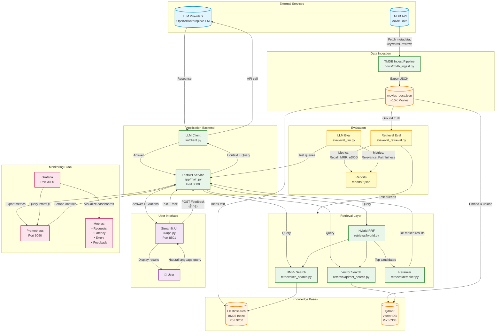

# CineRAG Architecture Diagram

## System Architecture



## Component Details

### External Services
- **TMDB API**: Source of movie metadata, keywords, and reviews
- **LLM Providers**: OpenAI, Anthropic, or vLLM for answer generation

### Data Ingestion
- **TMDB Ingest Pipeline**: Fetches and enriches movie data
- **movies_docs.json**: Structured movie documents (~10K movies)

### Knowledge Bases
- **Elasticsearch**: BM25 keyword-based search index
- **Qdrant**: Vector database with semantic embeddings

### Retrieval Layer
- **BM25 Search**: Keyword matching via Elasticsearch
- **Vector Search**: Semantic similarity via Qdrant embeddings
- **Hybrid RRF**: Reciprocal Rank Fusion of BM25 + Vector
- **Reranker**: Cross-encoder model for final ranking refinement

### Application Backend
- **FastAPI Service**: RESTful API with `/ask` and `/feedback` endpoints
- **LLM Client**: Multi-provider LLM integration

### User Interface
- **Streamlit UI**: Interactive web interface with:
  - Natural language query input
  - Movie poster grid display
  - Feedback collection (👍/👎)
  - Backend and filter controls

### Monitoring Stack
- **Prometheus**: Metrics collection and storage
- **Grafana**: Real-time dashboards showing:
  - Request rates and latency
  - Error tracking
  - Backend usage distribution
  - User feedback sentiment

### Evaluation
- **Retrieval Evaluation**: Tests retrieval quality with Recall, MRR, nDCG
- **LLM Evaluation**: Assesses answer quality with Relevance, Faithfulness, Coherence

## Data Flows

### 1. Ingestion Flow
```
TMDB API → Ingest Pipeline → movies_docs.json → {Elasticsearch, Qdrant}
```

### 2. Query Flow
```
User → Streamlit UI → FastAPI → Retrieval Layer → {ES, Qdrant} → Reranker → LLM → Response
```

### 3. Feedback Flow
```
User → 👍/👎 → Streamlit UI → FastAPI /feedback → Prometheus → Grafana
```

### 4. Monitoring Flow
```
FastAPI → Prometheus /metrics → Prometheus → Grafana Dashboards
```

## Technology Stack

| Component | Technology | Port |
|-----------|-----------|------|
| Vector DB | Qdrant 1.9.0 | 6333 |
| Search Engine | Elasticsearch 8.14.1 | 9200 |
| Backend API | FastAPI + Uvicorn | 8000 |
| Frontend UI | Streamlit | 8501 |
| Metrics | Prometheus | 9090 |
| Dashboards | Grafana | 3000 |
| Embeddings | sentence-transformers (all-MiniLM-L6-v2) | - |
| Reranker | cross-encoder (ms-marco-MiniLM-L-6-v2) | - |

## Performance Metrics

### Retrieval Performance (5 test queries)
- **Hybrid + Rerank**: 80% Recall@5, 0.726 nDCG@10 (Winner)
- **Hybrid**: 60% Recall@5, 0.567 nDCG@10
- **Vector Only**: 40% Recall@5, 0.418 nDCG@10
- **BM25 Only**: 20% Recall@5, 0.26 nDCG@10

### LLM Answer Quality (10 test queries)
- **Overall Score**: 0.856 mean (0.938 median)
- **Relevance**: 0.925 (excellent query understanding)
- **Faithfulness**: 0.85 (minimal hallucinations)
- **Coherence**: 0.775 (good readability)
- **Aspect Coverage**: 0.875 (comprehensive answers)
